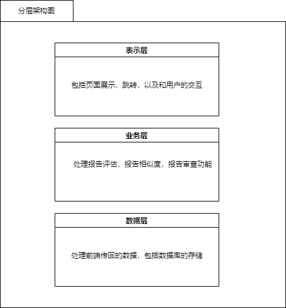
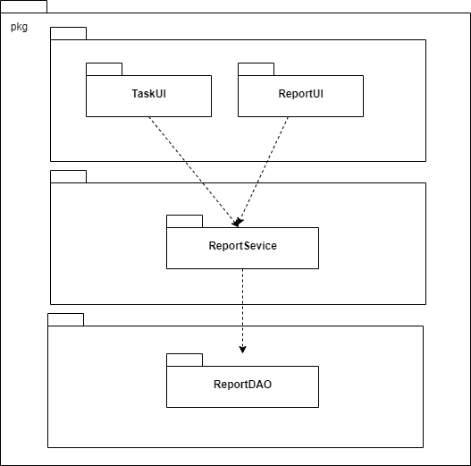

  <h2>迭代二设计文档</h2>

| 变更日期  | 变更人 | 内容       | 版本 |
| --------- | ------ | ---------- | ---- |
| 2022/3/25 | 曾斌   | 创建改文档 | 1.0  |
|           |        |            |      |
|           |        |            |      |

### 1.引言

#### 1.1编写目的

本文提供outlast团队研发的众包测试平台的软件架构概览，采用若干架构师图描述系统的不同方面，以便表示构造系统所

需要的重要架构决策。

#### 1.2对象与范围

本文档的读者是outlast团队内部的开发和管理人员，参考了RUP的《软件架构文档模版》，用于

指导下一循环的代码开发和测试工作。

#### 1.3参考文献

《软件需求规格说明书》

《软件架构文档模版》

### 2.逻辑视角

#### 2.1分层架构图

#### 2.2逻辑包图

### 3.组合视角

#### 3.1物理包的划分

| 开发包        | 依赖的开发包 |
| ------------- | ------------ |
| entity        |              |
| model         | vo           |
| view          | util，vo     |
| controller    | model，view  |
| util          |              |
| vo            |              |
| ReportService | vo,entity    |
| TaskService   | vo,entity    |
| sql           | entity       |

### 4.接口视角

#### 4.1模块的职责

#### 4.2模块的接口规范

##### 4.2.1用户界面接口模块的分解

| 服务名                              | 服务                     |
| ----------------------------------- | ------------------------ |
| ReportService.submitReport          | 提交报告                 |
| ReportService.getReportByReportTime | 根据报告提交时间获取报告 |
| ReportService.getReportByReportId   | 根据报告id获取报告       |
|                                     |                          |
| TaskService.createTask              | 创建报告                 |
| TaskService.getAllTask              | 系统显示所有报告         |
| TaskService.getList                 | 显示报告列表             |
| TaskService.getCreated              | 获取已经创建的报告       |
| TaskService.getRecommend            | 获取推荐报告             |
|                                     |                          |
| UserService.userRegister            | 用户注册                 |
| UserService.userLogin               | 用户登录                 |
| UserService.userLogout              | 用户登出                 |
|                                     |                          |

##### 4.2.2业务逻辑模块的分解

| 服务名                              | 服务                                                         |
| ----------------------------------- | ------------------------------------------------------------ |
| ReportService.getSimilarByReportId  | 语法：ReportVO getSimilarByReportId(Integer reportId); 前置条件：reportid在数据库中有对应 后置条件：返回对应id的相似报告 |
| ReportService.getReportByReportTime | 语法：PageInfo<ReportVO> getReportByReportTime(Integer taskId,Integer pageSize, Integer currPage); 前置条件：ReportTime不能超过当前时间 后置条件：返回距离输入的时间最近的报告 |
| TaskOrderService.getDoing           | 语法：PageInfo<TaskOrderVO> getDoing(Integer currPage, Integer pageSize, Integer uid); 前置条件：众包工人接受了任务 后置条件：返回众包工人接受的任务 |
| TaskOrderService.getDone            | 语法：PageInfo<TaskOrderVO> getDone(Integer currPage, Integer pageSize, Integer uid); 前置条件：众包工人完成了一部分接受的任务 后置条件：返回已完成的任务 |
| TaskService.uploadExecutable        | 语法：ResultVO<FileInfoVO> uploadExecutable(int taskId, MultipartFile file); 前置条件：无 后置条件：数据库中添加工人上传的文档 |
| TaskService.getRecommend            | 语法：PageInfo<TaskVO> getRecommend(Integer uid, Integer recommendSize); 前置条件：管理员提前设置了推荐规则 后置条件：返回推荐任务 |
| UserService.updateInformation       | 语法：ResultVO<UserVO> updateInformation(UserVO user); 前置条件：用户已经完成注册，填写了相关的个人信息 后置条件：个人信息修改 |
| ReportService..submitReport         | 语法：public ResultVO<ReportVO> submitReport(ReportVO report) 前置条件：工人已经接受了报告对应的任务 后置条件：无 |

### 5.信息、vvvvvv..+v,视角

#### 5.1VO定义

- CommentVO

  | 含义       | 属性   | 字段        |
  | ---------- | ------ | ----------- |
  | 评论编号   | int    | id          |
  | 发布人编号 | int    | user_id     |
  | 报告编号   | int    | report_id   |
  | 评分       | int    | score       |
  | 描述       | string | description |
  | 评论时间   | date   | post_time   |
  |            |        |             |

  

- ReportVO

  | 含义       | 属性   | 字段        |
  | ---------- | ------ | ----------- |
  | 报告编号   | int    | id          |
  | 发布人编号 | int    | user_id     |
  | 任务编号   | int    | task_id     |
  | 描述       | string | description |
  | 步骤       | string | step        |
  | 设备       | string | equipment   |
  | 评论时间   | date   | post_time   |
  | 评分       | int    | score       |

  

- SupplementVO

  | 含义         | 属性   | 字段        |
  | ------------ | ------ | ----------- |
  | 补充报告编号 | int    | id          |
  | 发布人编号   | int    | user_id     |
  | 报告编号     | int    | report_id   |
  | 描述         | string | description |
  | 步骤         | string | step        |
  | 设备         | string | equipment   |
  | 评论时间     | date   | post_time   |
  |              |        |             |

- TaskOrderVO

  | 含义       | 属性   | 字段        |
  | ---------- | ------ | ----------- |
  | 任务编号   | int    | id          |
  | 任务名称   | string | name        |
  | 发布人编号 | int    | user_id     |
  | 发布人姓名 | string | user_name   |
  | 任务状态   | int    | status      |
  | 创建时间   | date   | create_time |
  |            |        |             |

- TaskVO

  | 含义       | 属性   | 字段        |
  | ---------- | ------ | ----------- |
  | 任务编号   | int    | id          |
  | 任务名称   | string | name        |
  | 发布人编号 | int    | user_id     |
  | 发布人姓名 | string | user_name   |
  | 描述       | string | description |
  | 工人数量   | string | step        |
  | 设备       | string | equipment   |
  | 创建时间   | date   | create_time |
  | 难度       | int    | difficulty  |
  | 类型       | int    | type        |
  | 设备需求   | string | equipment   |
  | 其他描述   | string | others      |
  |            |        |             |

- UserVO

  | 含义         | 属性   | 字段        |
  | ------------ | ------ | ----------- |
  | 用户编号     | int    | uid         |
  | 用户名       | string | uname       |
  | 用户密码     | string | password    |
  | 用户类型     | int    | user_role   |
  | 用户电话     | string | phone       |
  | 用户邮箱     | string | email       |
  | 个人信息描述 | string | description |
  | 能力值       | double | ability     |
  | 表现         | string | preference  |
  | 活动         | string | activity    |
  | 使用设备     | string | equipment   |

