# COLLECT众测平台使用指南

## Group：191250166_outlast

### 1.项目搭建

1、下载jenkins.war

2、在8082端口启动jenkins 

```bash
nohup java -jar /home/molgypeter/jenkins.war --ajp13Port=-1 --httpPort=8082 >/dev/null 2>&1 &
```

jenkins目录在/home/molgypeter/.jenkins

3、创建前端和后端的流水线。

### 2、webhook配置

1、jenkins中添加gitlab插件，配置gitlab。

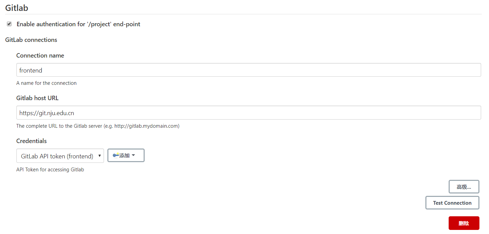

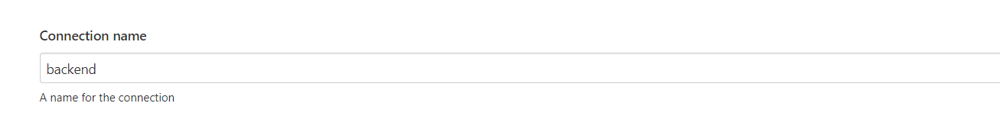

2、在前端和后端流水线中配置gitlab的构建触发器，生成Secret token，在git.nju.edu.cn上配置webhook触发构建。

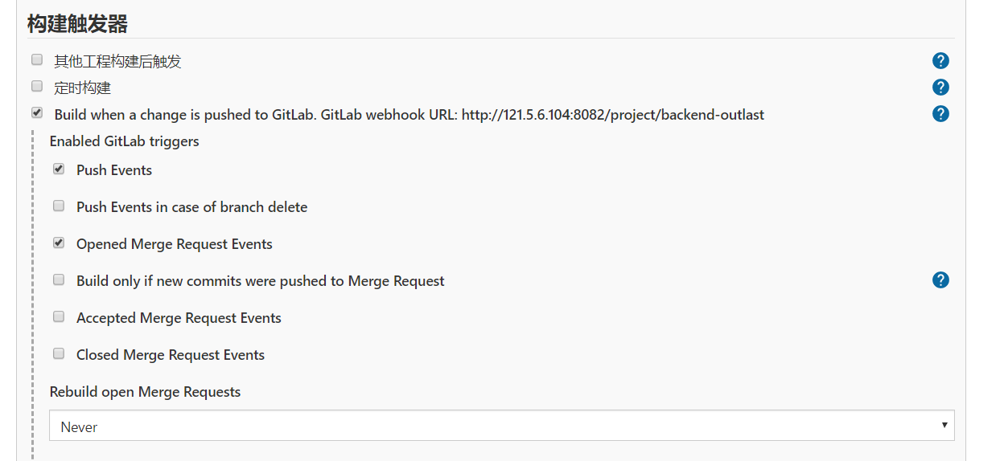

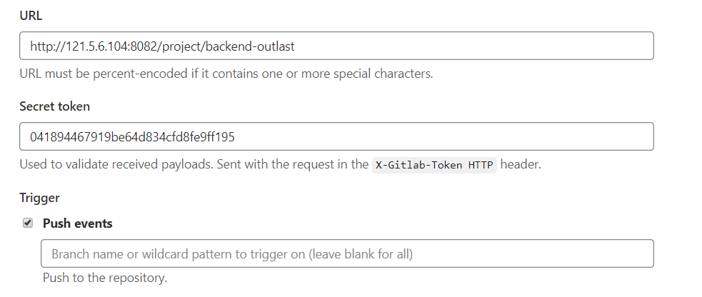

### 3. 脚本实现构建及部署

前端分为：‘Git'获取远程git仓库的代码，'Build'进行npm构建，'Deploy'将构建好的文件复制到特定目录下（使用了nginx进行页面的部署），最后将构建结果返回git仓库。

```
pipeline {
    agent any

    stages {
        stage('Git') {
            steps {
                git credentialsId: 'ed08ca8b-f78c-40d4-8170-0eaf29cd6b7b', url: 'https://git.nju.edu.cn/191250194/frontend-outlast.git'
            }
        }
        stage('Build') {
            steps {
                //sh "chmod -R a+x ./node_modules/.bin/*"
                //sh "rm -rf ./node_modules"
                sh "npm install"
                sh "npm run build"
            }
        }
        stage('Deploy') {
            steps {
                sh "rm -rf /home/molgypeter/frontend/*"
                sh "cp -r dist/* /home/molgypeter/frontend"
            }
        }
    }
    
    post {
        success{
            updateGitlabCommitStatus name: 'build', state: 'success'
        }
        failure {
            updateGitlabCommitStatus name: 'build', state: 'failed'
        }
    }
}
```

后端分为以下的步骤：‘Git'获取远程git仓库的代码，'SQL'执行SQL语句，'CleanFiles'清楚上传的静态文件，'Build'进行构建并生成覆盖率报告（使用nginx部署页面），'Deploy'执行shell脚本进行部署，最后将构建结果返回git仓库。

```
pipeline {
    agent any

    stages {
        stage('Git') {
            steps {
                git credentialsId: 'ed08ca8b-f78c-40d4-8170-0eaf29cd6b7b', url: 'https://git.nju.edu.cn/191250194/backend-outlast.git'
            }
        }
        stage('SQL') {
            steps {
                sh "mysql -uroot -p123456 -h localhost < /home/molgypeter/.jenkins/workspace/backend-outlast/sql/collect.sql "
            }
        }
        stage('CleanFiles') {
            steps {
                sh "rm -rf /home/molgypeter/static/"
            }
        }
        stage('Build') {
            steps {
                sh "mvn clean package"
                sh "rm -rf /home/molgypeter/jacoco/* && cp -r target/site/jacoco/* /home/molgypeter/jacoco"
            }
        }
        stage('Deploy') {
            steps {
                withEnv(['JENKINS_NODE_COOKIE=dontkillme']) {
                    sh "sh /home/molgypeter/backend/run_backend.sh"
                }
            }
        }
    }
    
    post {
        success{
            updateGitlabCommitStatus name: 'build', state: 'success'
        }
        failure {
            updateGitlabCommitStatus name: 'build', state: 'failed'
        }
    }
}
```

其中的run_backend.sh需要结束占用8081端口的进程，执行新的jar部署到8081：

```shell
#!/bin/bash

SOURCE_DIR=/home/molgypeter/.jenkins/workspace/backend-outlast/target
TARGET_DIR=/home/molgypeter/backend

JAR_NAME=`ls $SOURCE_DIR | grep '.*\.jar$'`
if [ -n "$JAR_NAME" ];then
    echo '删除旧版本'
    rm $TARGET_DIR/*.jar && cp $SOURCE_DIR/$JAR_NAME $TARGET_DIR
fi
echo '检查8081端口是否被占用...'
pid_blog=`netstat -tunpl | grep 8081|awk '{printf $7}'|cut -d/ -f1`
if [ "$pid_blog" != "" ];
    then
        echo '8081端口被占用'
        kill -9 "$pid_blog"
        echo $pid_blog '进程已被杀死'
    else
        echo "端口未被占用"
fi
echo '后台运行jar包...'
fileName=`date +log-%Y-%m-%dT%H%M%S.txt`
nohup java -jar $TARGET_DIR/$JAR_NAME --server.port=8081 >$TARGET_DIR/logs/$fileName 2>&1 &
echo 'jar包部署结束'
```

目前流水线脚本和shell脚本中的文件目录需要视具体情况而自定义，准备在迭代三中使用环境变量来方便路径的配置。

### 4. 项目使用前提

在application.yml中配置mysql数据库密码和服务器的文件存储目录。

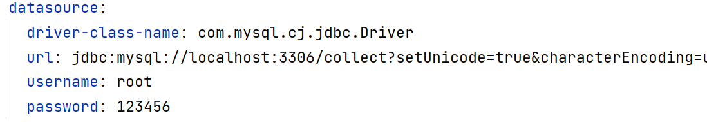

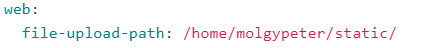

### 5. 自动化部署演示视频

### 6. CICD阶段记录

#### 后端

commit记录：

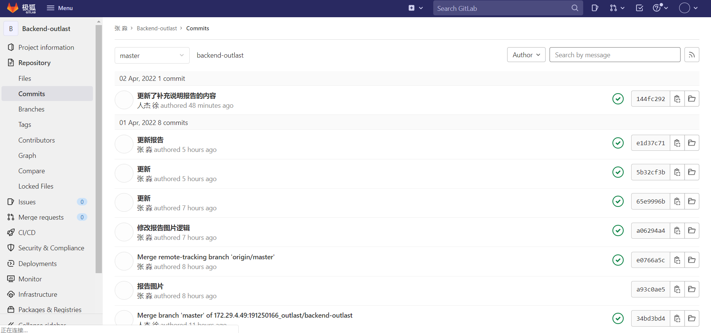

jenkins构建记录（因为新增了'CleanFiles'步骤而没有显示更早的阶段视图）：

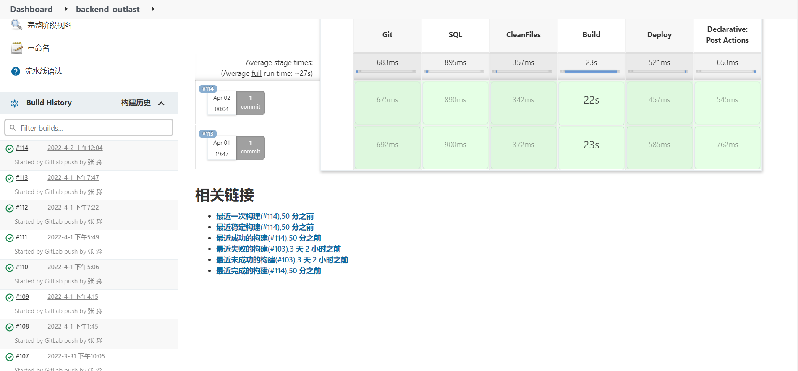

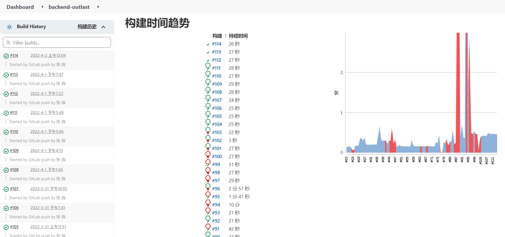

#### 前端

commit记录：

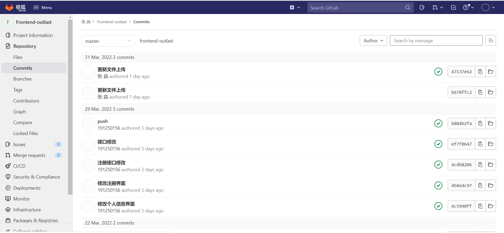

jenkins构建记录：

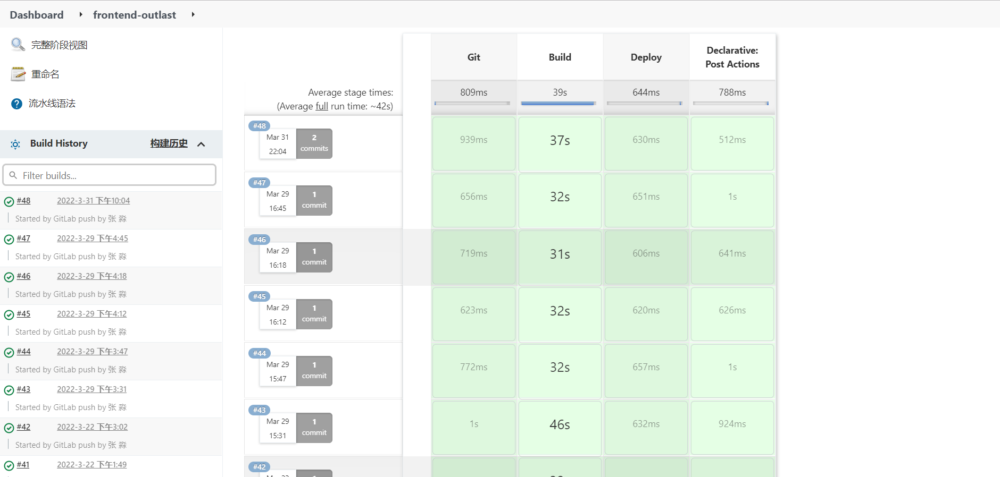

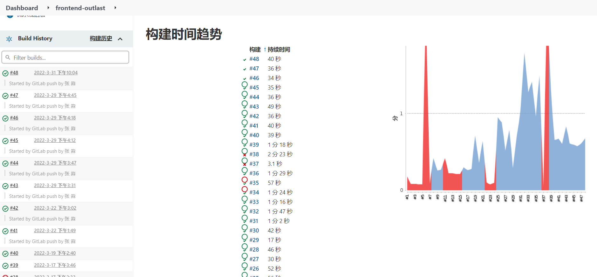

