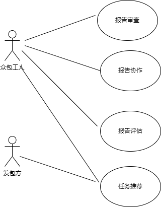

  <h2>
    需求规格说明文档
  </h2>

### 团队名称：outlast

### 修改记录：

| 修改人员 | 修改日期  | 修改内容     | 版本号 |
| -------- | --------- | ------------ | ------ |
| 曾斌     | 2022/3/22 | 创建了此文档 | 1.0    |
|          |           |              |        |
|          |           |              |        |

## 1.引言

### 1.1目的

需求规格说明文档描述了outlast团队在迭代二中需要实现的用例场景，包括功能需求和非功能需求。开发小组以此为基础进行开发

### 1.2范围

迭代二是在迭代一的基础上，重点实现报告推荐，报告审查，报告评估，报告协作四项扩展功能，本文档主要针对于这四项功能及其相关场景进行用例分析

### 1.3 参考文献

(1) IEEE标准

(2)《软件工程与计算（卷二）软件开发的技术基础》

(3)《软件工程与计算（卷三）软件开发的技术基础》

(4) 用例文档

## 2. 总体描述

### 2.1 项目前景

#### 2.1.1 背景与机遇

在传统的测试活动中，软件产品迭代快速，软件运行的环境趋向于碎片化，传统的软件测试周期较长，测试运行环境较为单一，不能满足如今软件快速开发迭代周期长的特点。而众包测试通过召集大量众包工人，以软件用户的身份在线完成测试任务，对复杂真实的应用场景和真实用户表现有着良好的模拟，同时众包测试的测试周期相对于传统的软件测试更短，并且测试的成本会更低。协作式的众包测试，通过将工人群体智能汇聚，能够更高效地完成众包测试任务，通过引入测试过程的评价机制，从而更好地评价众包测试的结果，更好地进行测试结果聚合优化。

在此基础上，我们将在迭代一的基础上，将智能推荐算法和相似度算法等内容加入协作众包平台中，完善协作式众包平台的功能。报告评估和报告协作等功能将使得我们的众包协作平台有更多的方式，能够让发包方获取一篇报告的价值，从而更好的完成总包测试任务

#### 2.1.2 业务需求

BR1：在系统上线一个月后，至少有500个活跃众包工人

BR2：在系统上线一个月后，众包平台的报告数量达到10000篇

### 2.2 项目功能

SF1：允许用户根据选择的推荐规则查看推荐任务

SF2：允许接受了任务的工人评估该任务的其他报告

SF3：允许接受了任务的工人根据报告内容进行报告的补充说明

SF4：允许工人发布报告后查看相似的报告

SF5：允许工人查看相似报告之间的相似度

### 2.3用户特征

|    用户    | 特征                                                         |
| :--------: | ------------------------------------------------------------ |
| 众包发布方 | 系统的访问者，进行过一定的软件项目开发，需要用户对其进行众包测试 |
|  众包工人  | 对计算机技术及原理有一定了解，能够使用计算机中的各种测试软件进行测试 |

### 2.4 约束

CON1: 系统使用web界面

CON2: 系统使用迭代式的开发流程

CON3: 在开发过程中，开发者要提交软件需求规格说明书、测试文档等说明文档

## 3 详细需求描述

### 3.1 对外接口需求

#### 3.1.1 用户界面

界面应该是web界面，需要适应⼈机交互原则，即简介设计、易记性设计、⼀致性原则。 

#### 3.1.2 通信接口

1. TCP/IP通信协议接⼝ 
2. GSM/CDMA⽆线通信协议接⼝ 
3. SMS短消息通信协议接⼝ 
4. 联通⽹关通信协议接⼝ 
5. 防⽕墙通信接⼝ 
6. ajax
7. restful

### 3.2 功能需求

#### 3.2.8 用户获取推荐任务

##### 3.2.8.1 特性描述

用户在任务广场界面,获取推荐任务

优先级：高

##### 3.2.8.2 刺激响应序列

刺激：用户登录

响应：系统推荐任务和全部任务

| getRecommend               |                            |
| -------------------------- | -------------------------- |
| getRecommend.displayTask   | 系统显示推荐任务           |
| getRecommend.findRecommend | 系统在数据库中查找推荐任务 |
|                            |                            |

#### 3.2.9 众包工人对报告做出评估

##### 3.2.9.1 特性描述

已经接受了任务的工人在在此任务的报告界面给报告做出评分和评论

优先级：高

##### 3.2.9.2 刺激响应序列

刺激：工人点开已接受任务界面

响应：系统显示工人已经接受的任务

刺激：工人点击成任务中的查看报告

响应：系统显示对应报告的界面

刺激：工人在评论栏输入评论，在评分栏选择评分

响应：页面刷新，并将工人的评论和评分显示在报告界面

| reportComment                |                                    |
| ---------------------------- | ---------------------------------- |
| reportComment.makeComment    | 工人填写评论                       |
| reportComment.displayComment | 显示报告界面中所有工人的评论和评分 |
|                              |                                    |

#### 3.2.10 众包工人对报告进行补充说明

##### 3.2.10.1 特性描述

众包工人在报告界面做出补充说明报告

优先级：高	

##### 3.2.10.2 刺激响应序列

刺激：工人点开已接受任务界面

响应：系统显示工人已经接受的任务

刺激：工人点击成任务中的查看报告

响应：系统显示对应报告的界面

刺激：工人点击补充报告上方的填写补充说明报告

响应：系统显示空白的补充说明报告

刺激：工人填写补充说明报告

响应：系统将补充报告存入数据库，并显示在对应报告界面

| complement                   |                      |
| ---------------------------- | -------------------- |
| complement.makeComplement    | 做出补充说明报告     |
| complement.displayComplement | 显示补充说明报告列表 |
|                              |                      |

#### 3.2.11 众包工人查看相似报告

##### 3.2.11.1 特性描述

众包工人在提交报告后查看相似报告

优先级：高	

##### 3.2.11.2 刺激响应序列

刺激：工人提交报告

响应：系统根据工人提交的报告，在数据库中寻找相似报告

刺激：工人点击查看相似报告

响应：系统显示相似报告

### 3.3用例

- 用例图
- 

#### 3.2.8 用户查看推荐任务

- 用例编号：8
- 用例名称：推荐任务
- 参与者：发包方、众包工人
- 触发条件：用户想要查看推荐任务

- 前置条件：无

- 后置条件：无

- 主要事件流

  1. 用户登录任务界面
  3. 系统根据规则在所有任务中查找推荐任务
  4. 系统显示推荐任务
  
- 次要事件流

  无

#### 3.2.9 众包工人评论报告

- 用例编号：9

- 用例名称：评论报告

- 参与者：参与了任务的众包工人

- 触发条件：众包工人查看报告界面并评估

- 前置条件：众包工人已经接受了该任务

- 后置条件：无

- 主要事件流

  1. 众包工人打开已接受任务界面	
  2. 工人查看任务中其他工人的报告
  3. 系统显示这份报告的内容，评分和补充说明文档
  4. 工人根据内容做出评论

- 次要事件流

  无
  
- 错误流

  E1. 系统显示工人未接受此任务

  E2. 结束用例

#### 3.2.10 众包工人对报告进行补充说明

- 用例编号：10

- 用例名称：报告的补充说明

- 参与者：参与了任务的众包工人

- 触发条件：众包工人查看报告界面并对报告进行补充说明

- 前置条件：众包工人已经接受了该任务

- 后置条件：无

- 主要事件流

  1. 众包工人打开已接受任务界面	
  2. 工人查看任务中其他工人的报告
  3. 系统显示这份报告的内容，评分和补充说明文档
  4. 工人根据内容做出补充说明
  5. 工人提交补充说明报告

- 次要事件流

  无

- 错误流

  E1. 系统显示工人未接受此任务

  E2. 结束用例

#### 3.2.11 众包工人获取相似报告

- 用例编号：11

- 用例名称：获取相似报告

- 参与者：参与了任务的众包工人

- 触发条件：众包工人想要查看相似报告

- 前置条件：众包工人提交了报告

- 后置条件：无

- 主要事件流

  1. 众包工人提交报告	
  2. 系统根据众包工人提交的报告，在数据库中检索相似报告
  3. 系统根据报告的相似度，将最相似的报告返回工人
  4. 系统显示相似度最高的报告，并显示相似度
  5. 工人退出提交报告界面

- 次要事件流

  1. 众包工人在报告界面查看相似报告

  2. 系统找到原来匹配的相似报告

  3. 系统显示相似报告和报告的相似度

     

- 错误流

  E1. 系统显示工人未提交报告

  E2. 结束用例

### 3.4 非功能需求

#### 3.4.1  安全性

Safety1: 系统要根据不同的用户身份设置不同的访问权限

Safety2: 系统要防止数据在传输过程中被窃取和破解

Safety3: 系统需要有安全员维护

Safety4: 用户的数据和文件不能未经授权泄漏给任何第三方

#### 3.4.2  可靠性

Reliability1: 系统的数据需要实时备份，在数据出现错误或丢失时可及时恢复

Reliability2: 系统数据的恢复要在 6 小时内完成

Reliability3: 服务端要能应对高流量的访问请求

Reliability4: 系统在与用户交互时，如果出现网络故障能够平稳运行

#### 3.4.3  易用性

Usability1: 无需用户使用手册或专业培训即可直接使用系统

Usability2: 页面的文字和色彩应当明确、无二义性

Usability3: 用户能够点击下载相关程序以及报告

Usability4: 系统页面没有四重以上的嵌套

#### 3.4.4  可维护性

Modifiability1: 系统开发过程遵循相关开发规则，按照对应文档进行开发

Modifiability2: 安全人员每天对系统进行维护查看

#### 3.4.5 可移植性

Portability1：系统或部件可以在 6 个人月内从 windows10 系统迁移至ubuntu 操作系统

Portability2：数据库可在 15个人月内从 Mysql 数据库迁移至 Oracle 数据库

#### 3.4.6  约束

IC1: 系统采用分层模型开发

IC2: 系统使用Mysql存储数据

IC3: 后端系统使用java语言开发

### 3.5  数据需求

#### 3.5.1  数据定义

DR1：系统需要存储众包发布方上传的项目以及说明文档

DR2:：系统需要存储所有的众包任务

DR3:：系统需要存储众包工人上传的结果报告以及复现步骤等内容

DR4:  系统需要存储报告中的评论，评分和补充说明报告

#### 3.5.2  默认数据

系统中某一项数据为空时，默认的数据为null

#### 3.5.3  数据格式要求

Format1: 说明文档以及结果报告支持docx、pdf、md各式

Format2: 众包任务的浏览页包括任务名称，发布时间、截止时间、进行状态

Format3: 任务报告的浏览页包括报告名称，报告内容，评分，评论和补充说明报告 